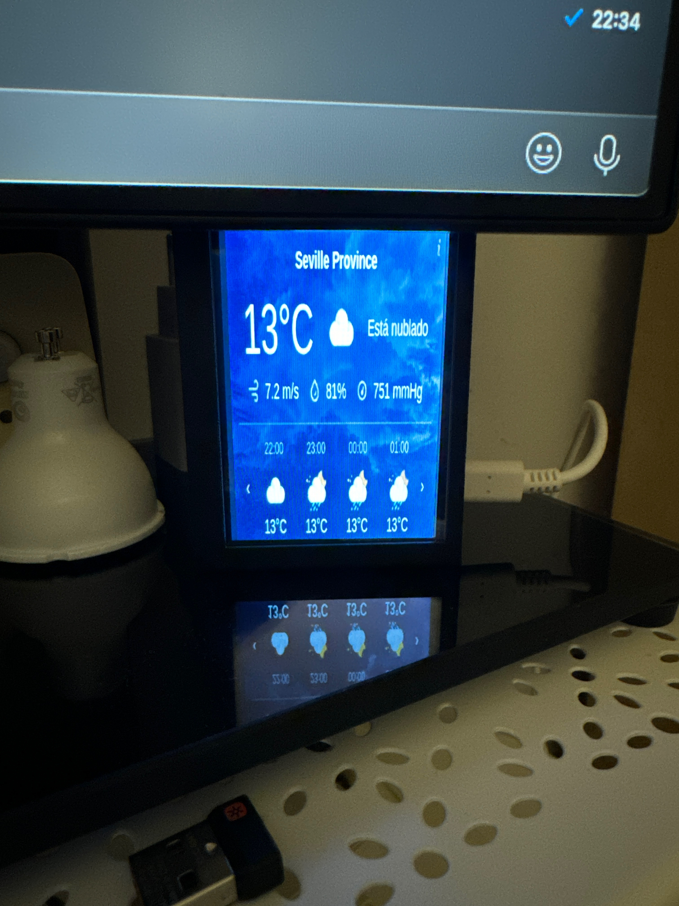

# Prueba con LCD en Raspberry 4B




## Pedido

[Raspberry Pi 3.5 Touch Screen 480*320 LCD TFT Display Optional ABS Metal Case Cooling Fan for Raspberry Pi 4 Model B or 3B+ 3B](https://www.aliexpress.com/item/32906213419.html?spm=a2g0o.order_list.order_list_main.5.709f1802ANJEru)

## Repo para instalarlo

https://github.com/goodtft/LCD-show

## Notas

Se ha intentado rotar la pantalla usando el script rotate.sh pero no funciona porque escribe en /boot/config.txt pero la última versión de Raspbian usa /boot/firmware/config.txt

Para rotar solo ha sido necesario cambiar la siguiente linea:

```
dtoverlay=tft35a:rotate=0
```

El angulo 0 es con la raspberry en vertical y el cable de alimentación abajo a la izauierda.

Tambien se ha creado un script para mostrar un widget con el tiempo en Sevilla:

```sh
cd $HOME/widget

DISPLAY=:0 nohup chromium-browser --kiosk --incognito $HOME/widget/weatherwidget.org.html &
#DISPLAY=:0 nohup chromium-browser --force-device-scale-factoro=1.25 --kiosk --incognito $HOME/widget/weatherwidget.org.html &
nohup unclutter -display :0 -idle 0 &
```

La linea comentada es por si se quiere usar en horizontal. En este caso hay que hacer un zoom del 125% para obtener algo que llene la pantalla.

Utiliza el siguiente código obtenido de la página https://weatherwidget.io:

```html
<html>
    <head>
        <meta http-equiv="refresh" content="300">
        <script async src="https://app2.weatherwidget.org/js/?id=ww_ee568ff4ef198"></script>
    </head>
    <body style="background-color: black">
        <div
            id="ww_ee568ff4ef198"
            v='1.3'
            loc='id'
            a='{"t":"horizontal","lang":"es","sl_lpl":1,"ids":["wl6605"],"font":"Arial","sl_ics":"one_a","sl_sot":"celsius","cl_bkg":"image","cl_font":"#FFFFFF","cl_cloud":"#FFFFFF","cl_persp":"#81D4FA","cl_sun":"#FFC107","cl_moon":"#FFC107","cl_thund":"#FF5722"}'>
            Más previsiones:
            <a
                href="https://oneweather.org/es/madrid/25_days/"
                id="ww_ee568ff4ef198_u"
                target="_blank">
                Tiempo en Madrid en 25 días
            </a>
        </div>
    </body>
</html>
```

Se ha modificado el html original con lo siguiente:
- La página se actualiza cada 5 minutos.
- Se ha cambiado el fondo de la página a negro.


